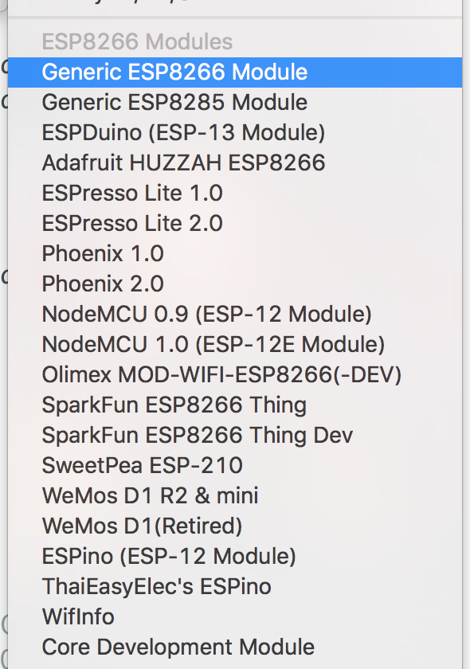
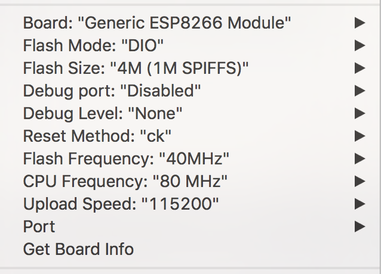

# Documentation
## Hardware
Chassis and display come from an "On Air" lamp [available on Amazon](https://www.amazon.fr/Desconocido-Bo%C3%AEte-lumineuse-On-Air/dp/B01DXV0RFU/ref=sr_1_1?ie=UTF8&qid=1509556260&sr=8-1&keywords=on+air).

Arduino compatible board used is a VROOM2 from Espressif (datasheet: http://www.microtechnica.tv/support/manual/ESP8266__WROOM_WiFi_Module_Datasheet__EN_v0.3.pdf) handled by the "Generic ESP8266" module.

## Configure Arduino environment for ESP8266
### Adding support for the board
In the settings window of Arduino IDE, as shown below, add the following URL in the "Additional Boards Manager" field:
http://arduino.esp8266.com/stable/package_esp8266com_index.json

### Configuring IDE for generic ESP8266
restart Arduino IDE
Go to menu Tools->Boards->Boards Manager
Enter "esp8266" to install the ESP8266 toolchain
Support for ESP8266 should then appear in the boads list under Tools->Boards menu as shown below

Once board is selected, IDE still needs to be configured according to board's characteristics.
Here is, below, configuration for VROOM2

