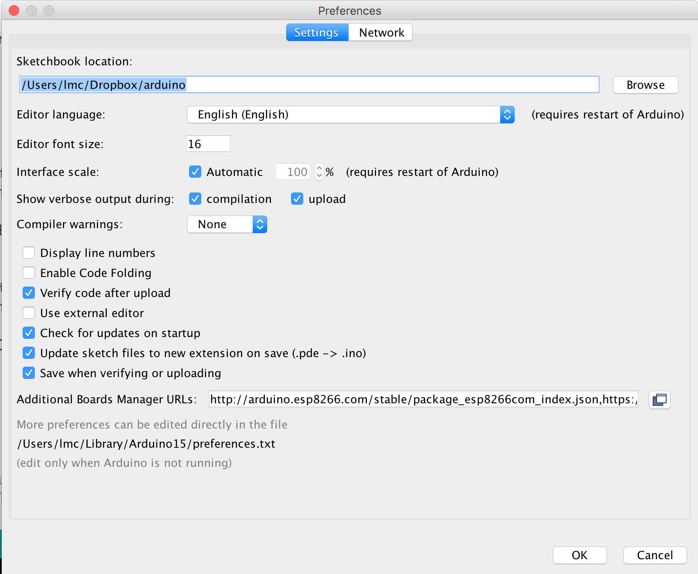

# Documentation
## Configure Arduino environment for ESP8266

In the settings window of Arduino IDE, as shown below, add the following URL in the "Additional Boards Manager" field:
http://arduino.esp8266.com/stable/package_esp8266com_index.json

