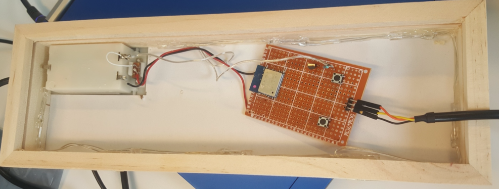
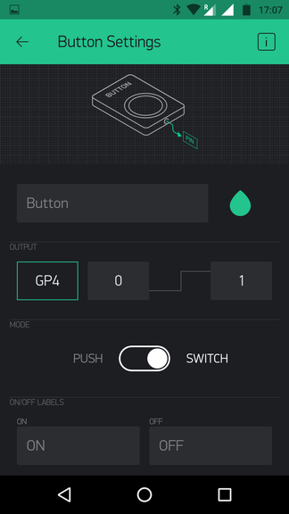
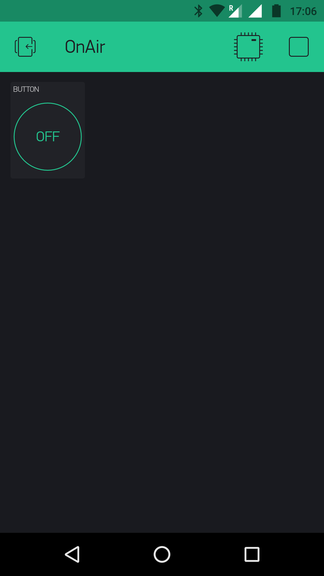

# OnAirSign
Information to remotely pilot "On Air" lamp using Arduino compatible board and a smartphone.

## Preliminary setup
Please refer to [associated documentation](Doc/README.md) in the `Doc` directory

## Electronics
The following schematic has been used:

 _Schematic missing, to be completed_ 

Its goal is to add a few conveniences in use the sign and of the ESP8266
* Batteries can still be used to power the sign, though a standard 5V power is recommended.
* Two buttons (PROG and RESET) allow easy restart and programming of the ESP8266

## Using Blynk service, with setup by serial port
### Prepare for use of Blynk

In the Arduino IDE, install the `Blynk` library with Library Manager via menu Sketch->Include Library->Manage Libraries

Blynk allows to directly pilot GPIO port of the ESP8266, as explained following the link below, with an example based on IFTT.
https://community.blynk.cc/t/blynk-ifttt-details-guide-how-to-connect-both/5772

In our case, we connected "On Air" sign LEDs command to port 4 (D4)
We need then to send a PUT request on http://blynk-cloud.com/{AUTH}/pin/D4 with ["1"] or ["0"] in  request BODY to switch ON or OFF the sign.
_Note_: {AUTH} is to be replaced by the value of your blynk token.

### Arduino code to use Blynk service

Code of  show of to make the ESP8266 react to action on Blynk App.

### Install Arduino sketch

### Create a Blynk application

Add a button in your Blynk project with the following settings :
* output is GPIO port 4 (GP4)
* use "switch" mode

Once everything is ready, run you app and your Blynk app should look like below:

### Using Blynk service, with OTA ESP8266 configuration

